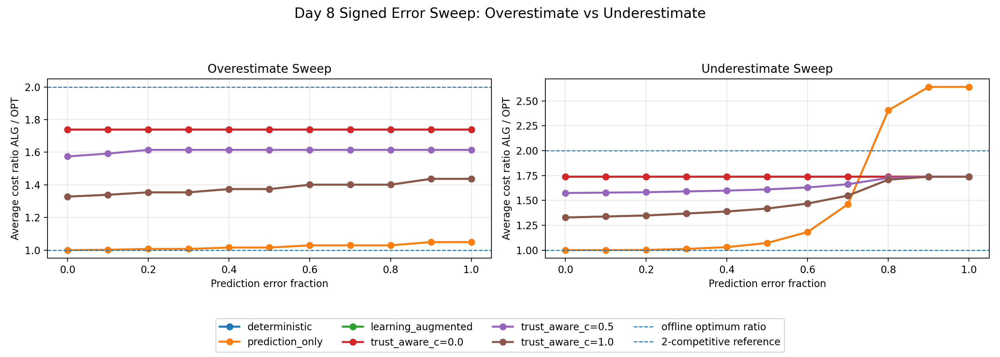
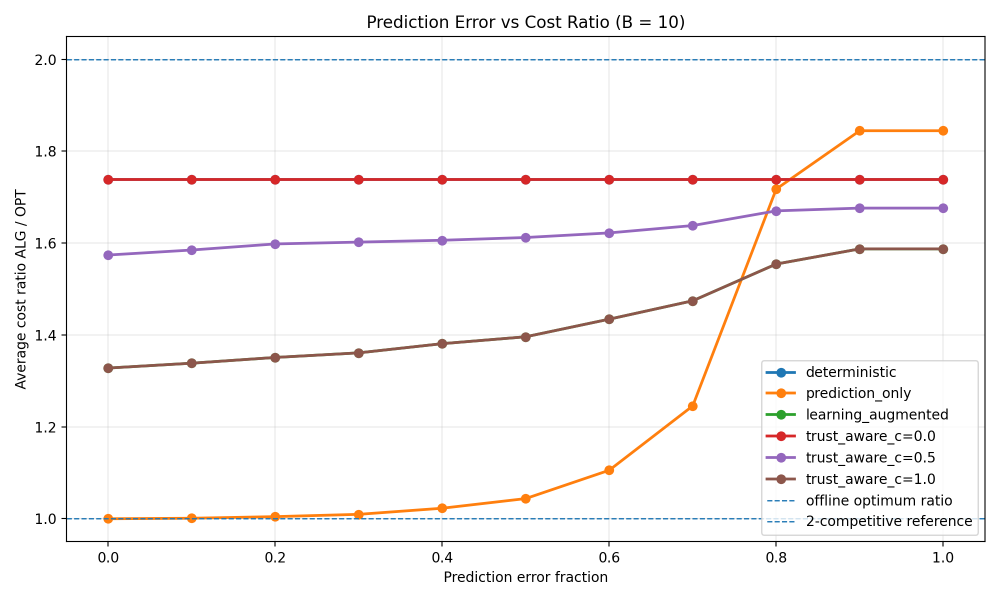
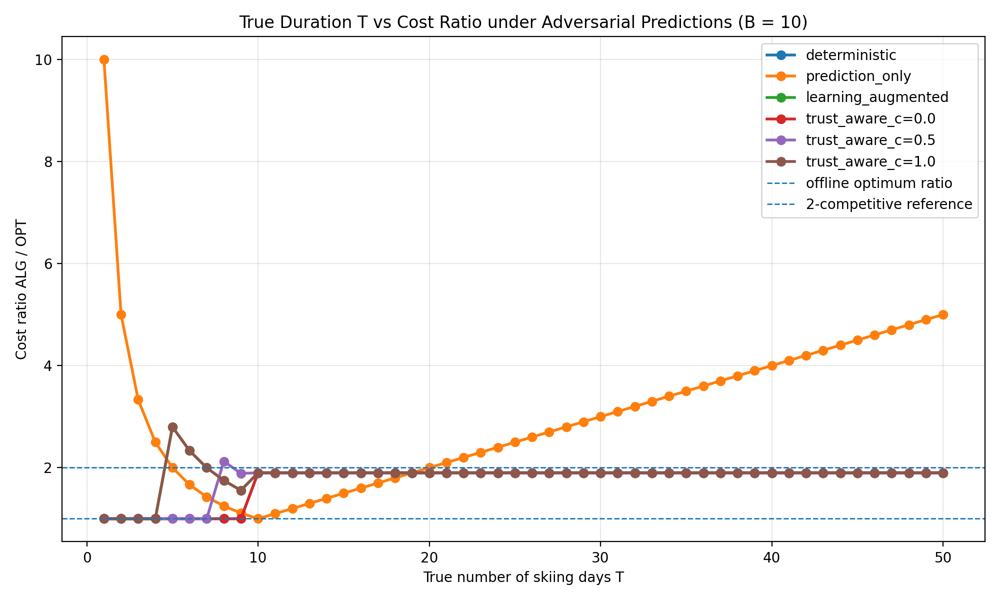
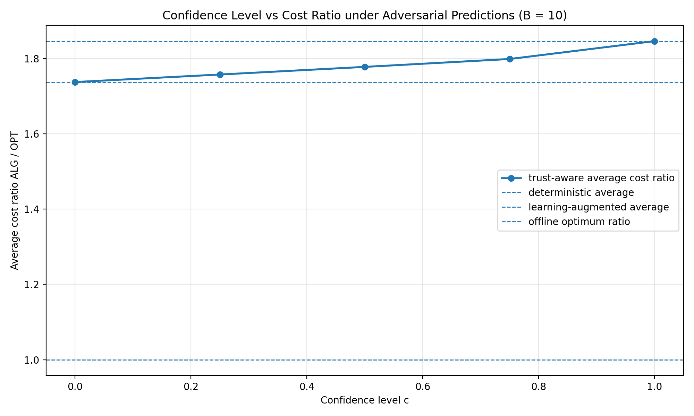
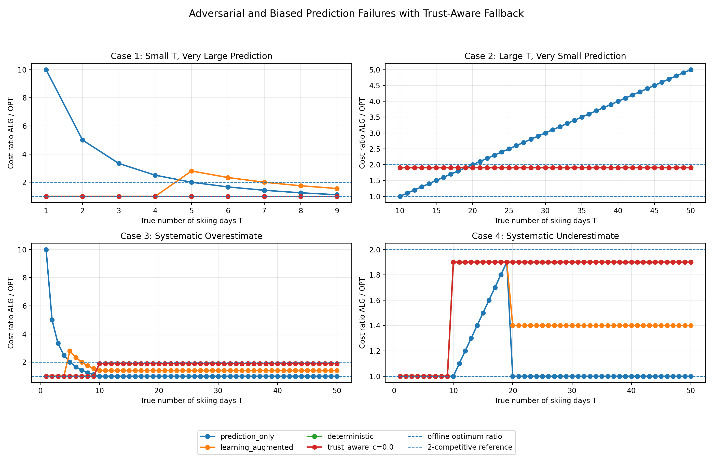

# Trust-Aware Learning-Augmented Ski Rental under Unreliable Predictions

## Main Message

**Prediction-only policies can fail under adversarial prediction error, while trust-aware fallback preserves robustness.**

This project studies a learning-augmented version of the classical ski rental problem. The goal is to understand how online algorithms can use machine-learned predictions when they are helpful, without suffering catastrophic loss when predictions are inaccurate, biased, or adversarial.

The core idea is simple:

Use predictions when confidence is high.
Fall back toward the deterministic baseline when confidence is low.

---

## Research Question

How can an online ski-rental algorithm use predictions to improve performance while remaining robust when those predictions are unreliable?

More specifically:

Can we design a prediction-aware algorithm that is consistent under accurate predictions
and still O(1)-competitive under arbitrary prediction error?

---

## Why This Matters

Learning-augmented algorithms use machine-learned predictions to improve online decision-making. These predictions can help when they are accurate, but they can also be dangerous when they are wrong.

A prediction-only policy may look strong under accurate predictions, but it can fail badly under adversarial predictions. For example, if the true season is long but the prediction says the season is short, the policy may keep renting forever.

This project targets an active but still underdeveloped problem: robust online decision-making with unreliable learned predictions.

---

## Problem Setting

In the classical ski rental problem:

T = true number of skiing days
B = buying cost
p = predicted number of skiing days

Renting costs `1` per day. Buying costs `B` once.

The offline optimum is:

OPT(T, B) = min(T, B)

If an online algorithm buys on day `d`, its cost is:

ALG(T, B, d) =
    T,             if T < d
    (d - 1) + B,   if T ≥ d

The competitive ratio is:

CR = ALG / OPT

---

## Algorithms Implemented

This repository implements and compares four main algorithms.

### 1. Deterministic Baseline

The classical deterministic ski-rental algorithm buys on day:

d_base = B

It is robust and has competitive ratio below `2`, but it does not use predictions.

### 2. Prediction-Only Policy

The prediction-only policy fully trusts the prediction:

if p ≥ B:
    buy immediately
else:
    rent forever

It can perform very well when predictions are accurate, but it can suffer unbounded loss when predictions are adversarial.

### 3. Learning-Augmented Policy

The learning-augmented policy uses a prediction-based buying threshold:

d_pred =
    ceil(λB), if p ≥ B
    B,        if p < B

where:

λ ∈ (0, 1]

A smaller `λ` means more aggressive early buying.

### 4. Trust-Aware Learning-Augmented Policy

The trust-aware algorithm interpolates between the prediction-augmented threshold and the deterministic threshold:

d_trust = ceil(c · d_pred + (1 - c) · B)

where:

c ∈ [0, 1]

is the confidence level.

Special cases:

c = 1  → fully trust the prediction-augmented threshold
c = 0  → fall back to the deterministic baseline

---

## Theoretical Claims

The project contains three proof sketches.

### Theorem 1: Consistency

When prediction is accurate and confidence is high, the trust-aware algorithm approaches the prediction-augmented cost.

Informally:

c → 1 and η → 0
⇒ C_trust(T, B, p, c) → C_pred(T, B, p)

where:

η = |p - T|

The proof sketch is in:

notes/theorem_1_consistency.md

### Theorem 2: Robustness

Under arbitrary prediction error, if the trust-aware buying threshold is controlled by the deterministic threshold, the algorithm remains constant-competitive.

A representative condition is:

λB ≤ d_trust ≤ B

Then:

C_trust / OPT ≤ O(1 / λ)

For fixed `λ`, this is:

O(1)

The proof sketch is in:

notes/theorem_2_robustness.md

### Theorem 3: Adversarial Separation

Prediction-only policies can suffer unbounded degradation under adversarial predictions.

Counterexample:

T >> B
p = 1

Prediction-only rents forever:

C_prediction_only = T
OPT = B
CR_prediction_only = T / B → ∞

Trust-aware fallback buys by day `B`:

C_trust = 2B - 1
CR_trust = 2 - 1/B < 2

The proof sketch is in:

notes/theorem_3_counterexample.md

---

## Main Experiment Results

### 1. Signed Prediction Error Sweep

The signed error sweep tests both overestimation and underestimation.

Overestimate:

p = T · (1 + error_fraction)

Underestimate:

p = T · (1 - error_fraction)

The key result is that prediction-only can look strong under overestimation but fails under severe underestimation.



---

### 2. Prediction Error vs Cost Ratio

This figure shows how the average cost ratio changes as prediction error increases.



---

### 3. True Duration vs Cost Ratio

This figure shows how different algorithms behave across true season lengths under adversarial predictions.



---

### 4. Confidence Level vs Cost Ratio

This figure shows how the trust-aware algorithm changes as confidence increases.

The main pattern is:

higher confidence → more prediction-dependent
lower confidence  → more robust fallback behavior



---

### 5. Adversarial Prediction Failure

This is the most important figure.

It shows four adversarial or biased prediction cases:

Case 1: small T, very large prediction
Case 2: large T, very small prediction
Case 3: systematic overestimate
Case 4: systematic underestimate

The key takeaway is that prediction-only can fail badly, while trust-aware fallback remains controlled.



---

## How to Reproduce

### 1. Clone the repository

### 1. Clone the repository

```bash
git clone https://github.com/casey2346/trust-aware-learning-augmented-ski-rental.git
cd trust-aware-learning-augmented-ski-rental

### 2. Create and activate a Python environment

```bash
python3 -m venv .venv
source .venv/bin/activate
```

### 3. Install dependencies

```bash
pip install -r requirements.txt
```

### 4. Run all experiments

```bash
PYTHONPATH=. python3 experiments/run_all.py
```
If successful, the terminal should end with:

All main experiments completed successfully.

### 5. Regenerate key figures individually

Run the main Day 8 signed error sweep:

```bash
PYTHONPATH=. python3 experiments/error_sweep.py
```
Run the Day 8 adversarial test:

```bash
PYTHONPATH=. python3 experiments/adversarial_test.py
```

Run Day 9 report-ready figures:

```bash
PYTHONPATH=. python3 experiments/day9_make_figures.py
```

Run Day 10 adversarial prediction failure experiment:

```bash
PYTHONPATH=. python3 experiments/day10_adversarial_prediction_failure.py
```

---

## Repository Structure

trust-aware-learning-augmented-ski-rental/
├── src/
│   ├── ski_rental/
│   │   ├── problem.py
│   │   ├── baselines.py
│   │   ├── prediction_only.py
│   │   ├── learning_augmented.py
│   │   └── trust_aware.py
│   └── predictors/
│       └── noise_models.py
├── experiments/
│   ├── day2_baseline_curve.py
│   ├── day3_prediction_only_curve.py
│   ├── day4_noise_models.py
│   ├── day5_learning_augmented_curve.py
│   ├── day6_trust_aware_curve.py
│   ├── error_sweep.py
│   ├── day9_make_figures.py
│   ├── day10_adversarial_prediction_failure.py
│   ├── adversarial_test.py
│   ├── run_all.py
│   └── results/
├── figures/
│   ├── day2_deterministic_competitive_ratio.png
│   ├── day3_prediction_only_cost_ratio.png
│   ├── day4_noise_models_predictions.png
│   ├── day5_learning_augmented_lambdas.png
│   ├── day6_trust_aware_fallback.png
│   ├── day8_error_sweep.png
│   ├── day8_adversarial_test.png
│   ├── error_sweep_cost_ratio.png
│   ├── duration_sweep.png
│   ├── confidence_ablation.png
│   └── adversarial_prediction_failure.png
├── notes/
│   ├── day1_problem_definition.md
│   ├── day2_classical_baseline.md
│   ├── day3_prediction_only.md
│   ├── day4_prediction_error_model.md
│   ├── day5_learning_augmented.md
│   ├── day6_trust_aware.md
│   ├── day7_algorithm_blocks.md
│   ├── day8_experiment_framework.md
│   ├── day9_first_figures.md
│   ├── day10_adversarial_prediction_failure.md
│   ├── signed_error_and_bias_improvement.md
│   ├── theorem_1_consistency.md
│   ├── theorem_2_robustness.md
│   └── theorem_3_counterexample.md
├── paper/
│   ├── algorithm_blocks.md
│   └── technical_report.md
├── README.md
└── .gitignore

Main Files
Core implementation
src/ski_rental/problem.py
src/ski_rental/baselines.py
src/ski_rental/prediction_only.py
src/ski_rental/learning_augmented.py
src/ski_rental/trust_aware.py
src/predictors/noise_models.py
Experiments
experiments/error_sweep.py
experiments/day9_make_figures.py
experiments/day10_adversarial_prediction_failure.py
experiments/adversarial_test.py
experiments/run_all.py
Main figures
figures/day8_error_sweep.png
figures/error_sweep_cost_ratio.png
figures/duration_sweep.png
figures/confidence_ablation.png
figures/adversarial_prediction_failure.png
Theory notes
notes/theorem_1_consistency.md
notes/theorem_2_robustness.md
notes/theorem_3_counterexample.md

---

## Limitations

This project is a research-style prototype and has several limitations.

First, confidence `c` is manually specified rather than learned from data.

Second, the experiments use synthetic prediction errors rather than real prediction traces.

Third, the theoretical results are currently proof sketches rather than fully formal proofs.

Fourth, the trust-aware rule uses a simple convex interpolation between `d_pred` and `B`; other trust mechanisms may produce better trade-offs.

Fifth, the ski rental problem is intentionally simple, so future work is needed to test whether similar trust-aware fallback ideas transfer to more complex online decision problems.

---

## Future Work

Future directions include:

1. learning confidence automatically from historical prediction error;
2. tightening the theoretical competitive-ratio bounds;
3. extending the method to randomized ski rental;
4. testing on real or semi-real prediction traces;
5. applying trust-aware fallback to caching, scheduling, and resource allocation;
6. turning the proof sketches into fully formal theorem proofs.

---

## References

[1] A. R. Karlin, M. S. Manasse, L. Rudolph, and D. D. Sleator. Competitive snoopy caching. Algorithmica, 1988.

[2] A. Borodin and R. El-Yaniv. Online Computation and Competitive Analysis. Cambridge University Press, 1998.

[3] T. Lykouris and S. Vassilvitskii. Competitive caching with machine learned advice. International Conference on Machine Learning, 2018.

[4] M. Purohit, Z. Svitkina, and R. Kumar. Improving online algorithms via ML predictions. Advances in Neural Information Processing Systems, 2018.

[5] M. Mitzenmacher. Scheduling with predictions and the price of misprediction. ITCS, 2020.

[6] S. Angelopoulos, C. Dürr, S. Jin, S. Kamali, and M. Renault. Online computation with untrusted advice. ITCS, 2020.

[7] Y. Shin, C. Lee, G. Lee, and H.-C. An. Improved learning-augmented algorithms for the multi-option ski rental problem via best-possible competitive analysis. ICML, 2023.
